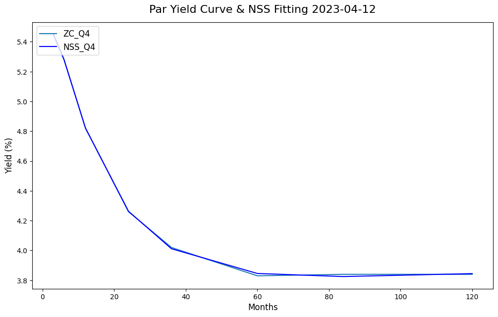
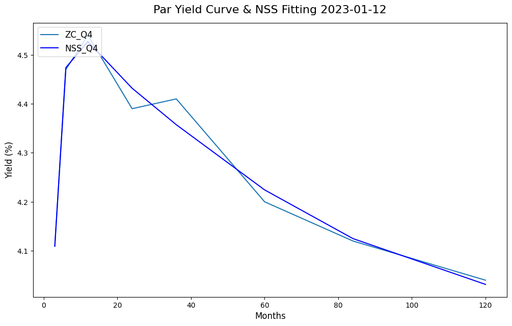
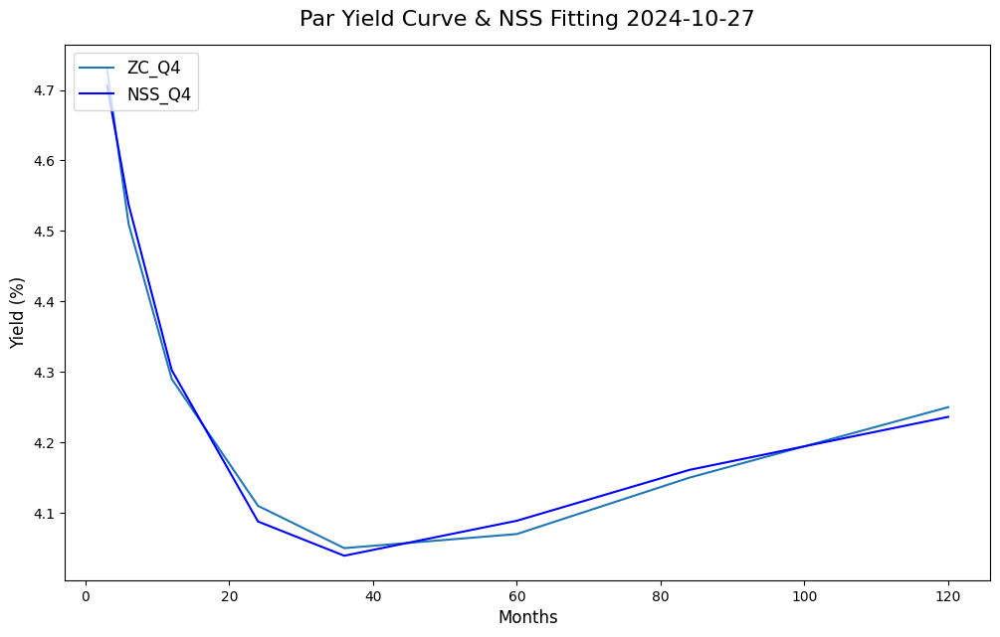
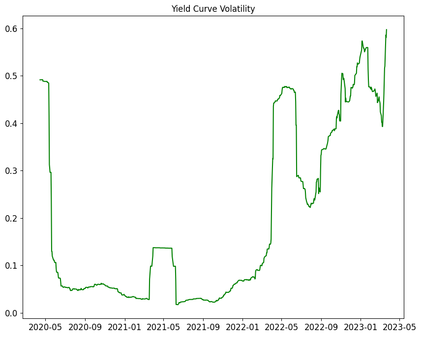
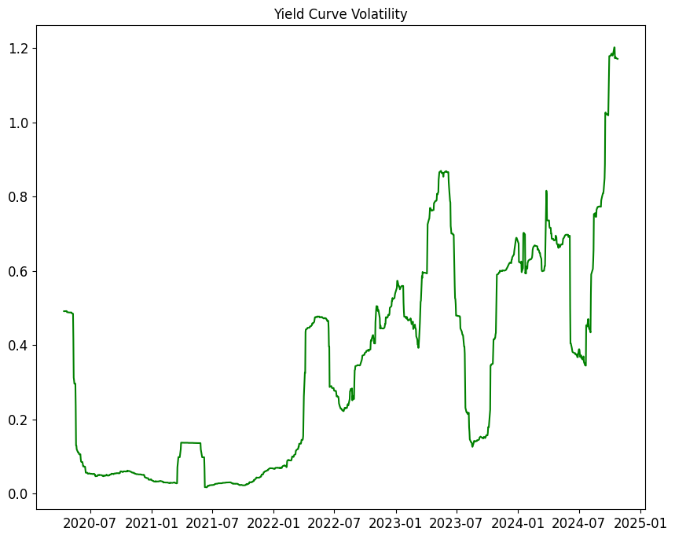

# Yield Curve Volatility Tracker

## Project Overview

This project, **Yield Curve Volatility Tracker**, monitors and analyzes U.S. Treasury yield curves over time. It collects daily yield data across multiple maturities (e.g., 1-month to 30-year) to analyze changes in yield curve dynamics, highlighting volatility and shifts that may indicate economic trends. The repository provides tools to access data, visualize yield curve movements, and calculate volatility metrics.

## Installation and Requirements

This project uses Python and requires the following libraries:

- `pandas` for data handling
- `requests` for accessing Treasury data
- `matplotlib` for plotting

Install dependencies using:
```bash
pip install pandas requests matplotlib
```

## Usage

1. **Download Data**  
   Use the `get_daily_treasury_yield()` function to download daily yield data for a specified year:
   ```python
   from yield_curve_volatility_tracker import get_daily_treasury_yield
   data = get_daily_treasury_yield(2023)
   ```

2. **Visualize Yield Curve**  
   The project provides functions to visualize daily yield curves and historical volatility. An example of how to plot the yield curve:
   ```python
   from yield_curve_volatility_tracker import plot_yield_curve
   plot_yield_curve(data)
   ```

3. **Calculate Volatility**  
   Calculate the annualized volatility for yield changes over different maturities:
   ```python
   from yield_curve_volatility_tracker import calculate_yield_volatility
   vol = calculate_yield_volatility(data)
   ```

## Results Summary

The **Yield Curve Volatility Tracker** generates insights on the yield curve’s volatility. Notable output includes yield curve plots over time and calculated volatility for various maturities, which can be used to track economic conditions.

### Sample Output


*Figure 1. Yield Curve with NSS Fitting for April 2023*


*Figure 2. Yield Curve with NSS Fitting for January 2023*


*Figure 3. Yield Curve with NSS Fitting for October 2024*


*Figure 4. Yield Curve Volatility Trend from 2020 to 2023*


*Figure 5. Yield Curve Volatility Trend from 2020 to 2024*

## Files in this Repository

- `yield_curve_volatility_tracker.py` - Main script with functions for data retrieval, processing, and visualization.
- `images/` - Contains example output images for quick reference.
- `docs/` - Includes a detailed methodology document in PDF format (see below).

## Methodology

For a complete methodology on data collection, calculations, and assumptions, refer to the [Methodology Document](docs/methodology.pdf) located in the `docs` folder. This document provides in-depth explanations for the approach and formulas used.

## License

This project is licensed under the MIT License.
